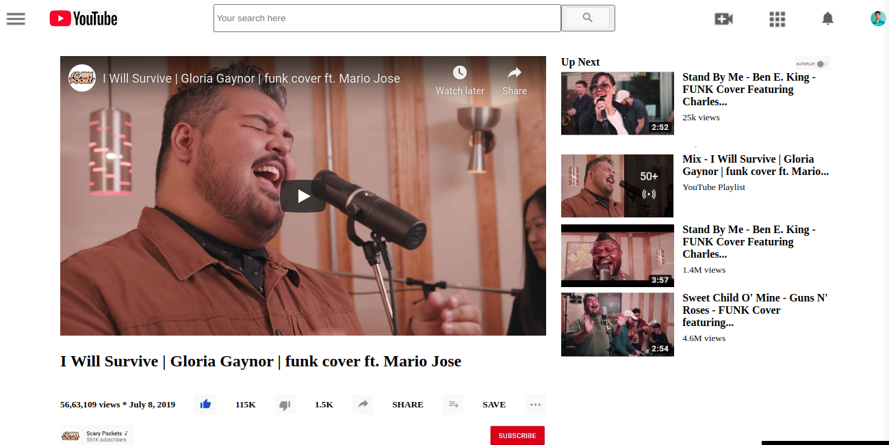

# Embeding Videos Images

> Luciano and Prabhakar 1st project in HTML&CSS3 module.

In this task we were required to create a clone of a video page of youtube.com using the best practices of GitHub.

## Built With

- HTML,
- CSS3,

## Live Demo

[Live Demo Link](https://github.com/lucianosarno/EmbedingVideosImages/blob/master/index.html)

## Getting Started

**This is an example of how you may give instructions on setting up your project locally.**
**Modify this file to match your project, remove sections that don't apply. For example: delete the testing section if the currect project doesn't require testing.**

## Authors

👤 Luciano Sarno

- Github: [@githubhandle](https://github.com/lucianosarno)

👤 Prabhakar Pandey

- Github: [@githubhandle](https://github.com/Prabhakarzx)
- Twitter: [@twitterhandle](https://twitter.com/prabhakarzx)
- Linkedin: [linkedin](https://www.linkedin.com/in/prabhakarzx/)

## 🤝 Contributing

Contributions, issues and feature requests are welcome!

Feel free to check the [issues page](issues/).

## Show your support

Give a ⭐️ if you like this project!

## Acknowledgments

- Microverse
- GitHub

## 📝 License

This project is open licensed.
